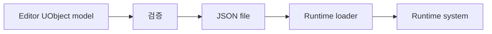

<!-- Copyright (c) 2026 Prayslaks. All rights reserved. Unauthorized copying, modification, or distribution of this file, via any medium is strictly prohibited. Proprietary and confidential. -->

# 시스템 문서 템플릿

이 템플릿은 유연한 outline으로 사용한다. 관련 없는 섹션은 삭제하고, 도메인별로 필요한 섹션을 추가한다.

> 기본 원칙: 사용자가 다른 언어를 명시하지 않으면 본문은 한글로 작성한다. 코드 식별자, 파일 경로, 명령어, schema key, API 이름은 원문을 유지한다.

---

## 제목

> 모호한 표현 대신 시스템 이름을 제목으로 쓴다.

예시: `Stage JSON Editor and Stage Spec Validation`

---

## 목적

> 이 시스템이 왜 존재하는지 2-5문장으로 설명한다.

답해야 할 질문:
- 어떤 문제를 해결하는가?
- 누가 사용하는가?
- 무엇을 대체하거나 단순화하는가?

---

## 빠른 시작

> 개발자나 디자이너가 이 시스템을 사용하기 위한 최단 성공 경로를 적는다.

포함할 수 있는 항목:
- 메뉴 경로
- 명령어
- 필요한 파일
- 기대 결과
- 첫 실행 시 필요한 공통 설정

---

## 핵심 개념

> 구현 세부사항보다 먼저 core concept를 설명한다.

좋은 질문:
- 이 시스템의 핵심 명사는 무엇인가?
- 어떤 object가 data를 소유하는가?
- 어떤 layer가 data를 편집, load, validate, execute하는가?
- runtime-only와 editor-only는 무엇인가?

---

## 아키텍처

> 주요 component와 관계를 설명한다.

권장 표:

| 구성 요소 | 계층 | 책임 | 주요 파일 |
| --- | --- | --- | --- |
| Name | Runtime/Editor/Tool/Data | 소유하거나 수행하는 일 | `Path` |

flow나 ownership을 설명할 때 Mermaid 다이어그램을 사용한다.

예시:

---

## 데이터 모델

> schema, struct, asset, config key, serialized data를 문서화한다.

권장 표:

| 필드 | 타입 | 필수 여부 | 의미 | 메모 |
| --- | --- | --- | --- | --- |
| `FieldName` | `Type` | Yes/No | 목적 | 제약 |

JSON은 shape 이해에 도움이 될 때만 짧은 예시를 포함한다.

---

## 런타임 흐름

> 일반 실행 중 어떤 일이 일어나는지 설명한다.

유용한 구조:
1. Entry point
2. Load/parse/construct
3. Validate
4. Apply/execute
5. Success/failure report

---

## 에디터 또는 도구 흐름

> 시스템에 editor UI, command-line tool, importer, exporter, asset processing이 있을 때 사용한다.

포함할 수 있는 항목:
- Tool을 여는 위치
- 각 action이 하는 일
- file read/write 위치
- save/overwrite 규칙
- preview 또는 validation behavior

---

## 검증 규칙과 불변 조건

> invalid data로부터 시스템을 보호하는 규칙을 나열한다.

권장 표:

| 규칙 | 심각도 | 적용 위치 | 결과 |
| --- | --- | --- | --- |
| Missing ID | Error | Save/load/runtime injection | Block |

hard error와 warning을 분리한다.

---

## 확장 지점

> 새 variant, field, event type, UI control, loader, validator, integration point를 안전하게 추가하는 방법을 설명한다.

각 확장 지점에는 다음을 포함한다.
- 어디를 편집하는가
- 무엇이 호환되어야 하는가
- 어떤 test 또는 manual check를 실행해야 하는가

---

## 문제 해결

> 흔한 failure mode를 문서화한다.

권장 표:

| 증상 | 가능성 높은 원인 | 해결 |
| --- | --- | --- |
| Tool opens but list is empty | Wrong folder or missing files | Check path |

---

## 테스트와 검증

> build command, unit/manual check, editor check, sample data check를 포함한다.

가능하면 실제로 실행한 command를 우선 적는다.

---

## 주요 파일

> implementation anchor를 한 줄 설명과 함께 나열한다.

예시:
- `Source/.../Thing.h`: Public API와 reflected type.
- `Source/.../Thing.cpp`: Runtime behavior.
- `Content/.../Example.json`: Example data.

---

## 열린 질문

> 유용할 때만 사용한다. 막연한 미래 아이디어가 아니라 아직 필요한 결정을 기록한다.

---

## 변경 기록

> 의미 있는 이력이 있는 기존 문서에서만 사용한다. 짧게 유지한다.
