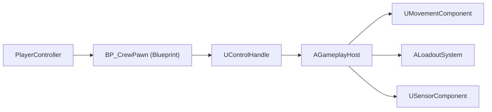
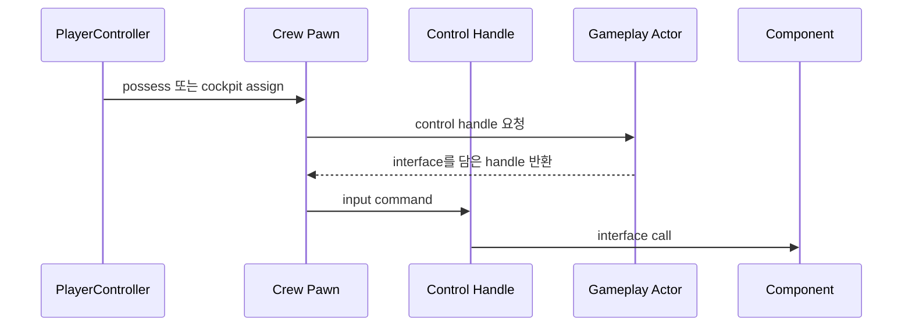
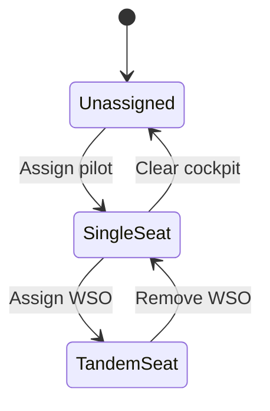
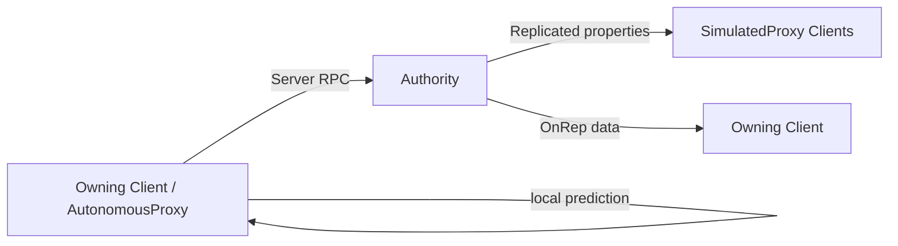
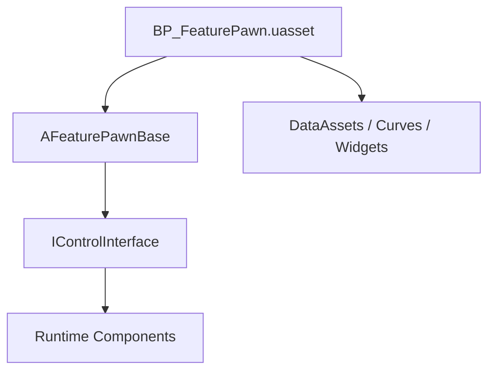

<!-- Copyright (c) 2026 Prayslaks. SPDX-License-Identifier: MIT -->

# Unreal 개요 문서용 Mermaid 패턴

Unreal Engine 프로젝트 개요 문서에 Mermaid 다이어그램을 작성할 때 이 패턴을 따른다. 사용자가 다른 언어를 명시하지 않으면 다이어그램 주변 설명은 한글로 작성한다.

---

## 일반 규칙

> 확인하지 못한 Blueprint graph 내부 동작을 사실처럼 다이어그램에 넣지 않는다.

- 다이어그램 하나에는 중요한 노드를 7개 안팎으로 유지한다. 더 커지면 하위 시스템 단면으로 분리한다.
- 문장 부호, slash, 괄호, 한글이 들어간 label은 따옴표로 감싼다.
- 개요가 목적이면 세부 구현보다 계층과 책임이 보이도록 label을 붙인다.
- 네트워크 role은 `Authority`, `AutonomousProxy`, `SimulatedProxy`, `Owning Client`, `Server`처럼 명시한다.
- Blueprint 에셋은 `BP_*`, `WBP_*`처럼 표시하고, source class는 `A*`, `U*`, `F*`, `I*` 또는 프로젝트 prefix를 유지한다.
- Interface가 중요한 경계일 때만 별도 노드로 표시한다.

---

## 소유권과 시스템 지도

object ownership, subsystem 관계, data dependency를 보여줄 때는 `flowchart LR`를 사용한다.

**좋은 용도**

- 무엇이 무엇을 소유하는지.
- 어떤 계층이 어떤 시스템과 통신하는지.
- Blueprint 에셋이 어떤 source class 위에 놓이는지.

**피할 것**

- 모든 component를 한 다이어그램에 넣기.
- 소유권, network replication, lifecycle을 한 다이어그램에 섞기.

---

## 런타임 명령 흐름

대표 command path에는 `sequenceDiagram`을 사용한다.

**좋은 용도**

- 입력 흐름.
- Handle/facade pattern.
- Interface call.
- Server RPC handoff.

네트워크가 중요할 때는 message label에 다음을 명시한다.
- `Server RPC`
- `local prediction`
- `replicated OnRep`
- `authority-only`

---

## 생명주기 또는 좌석 할당 상태

lifecycle state, seat authority, mode transition에는 `stateDiagram-v2`를 사용한다.

**좋은 용도**

- Seat assignment.
- Initialization lifecycle.
- Input/context mode change.
- Runtime feature state.

---

## 네트워크 경계

거대한 replication map보다 role 중심의 작은 다이어그램을 선호한다.

정확한 RPC와 replicated field는 다이어그램 옆의 문장이나 표에서 이름을 적는다.

---

## 블루프린트 경계

`.uasset` 계층이 중요하지만 graph 내부가 source-visible하지 않을 때 사용한다.

**반드시 분리해서 적을 것**

- 실제로 존재하는 asset path.
- 확인된 parent/source anchor.
- 이름이나 기존 문서에서 추론한 동작.
