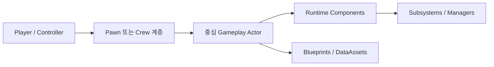
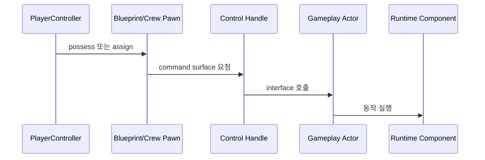

<!-- Copyright (c) 2026 Prayslaks. SPDX-License-Identifier: MIT -->

# 시스템 개요 문서 템플릿

Mermaid 중심의 Unreal 프로젝트 개요 문서를 만들 때 이 템플릿을 사용한다. 필요 없는 섹션은 삭제하고, 빠짐없는 나열보다 읽히는 문서를 우선한다.

> 기본 원칙: 사용자가 다른 언어를 명시하지 않으면 본문은 한글로 작성한다. Unreal 타입명, 파일 경로, API 이름, Blueprint 에셋명, 네트워크 role 이름은 원문을 유지한다.

---

## 제목

> 프로젝트나 기능 영역 이름을 사용한다.

예시: `Project Runtime System Overview`

---

## 목적

> 이 개요 문서가 개발자에게 무엇을 이해시켜 주는지 2-4문장으로 설명한다.

답해야 할 질문:
- 이 문서가 다루는 범위는 어디인가?
- 누가 가장 먼저 읽어야 하는가?
- 이후 어떤 하위 문서로 내려가면 되는가?

---

## 읽기 경로

> 독자가 시스템을 훑는 순서를 짧게 제시한다.

권장 표:

| 먼저 읽을 문서 | 다음 문서 | 이유 |
| --- | --- | --- |
| `Docs/SystemOverview.md` | `Docs/SpecificSystem.md` | 하위 시스템 세부사항 전에 전체 구도를 잡기 위해 |

---

## 전체 런타임 지도

> 주요 runtime role과 시스템 그룹을 보여준다.

다이어그램 뒤에는 소유권과 책임을 짧게 설명한다.

---

## 블루프린트/C++ 경계

> 어떤 동작이 source에서 보이고, 어떤 동작이 Blueprint 에셋 내부에 있어 source만으로는 보이지 않는지 설명한다.

권장 표:

| Blueprint 또는 Asset | Source Anchor | Source에서 확인 가능한 것 | 메모 |
| --- | --- | --- | --- |
| `Content/.../BP_Thing.uasset` | `AThingBase` | Parent/API만 확인 | Graph 내부는 에디터 확인 필요 |

검사하지 않은 `.uasset` 내부 동작은 조심스럽게 표현한다.

---

## 런타임 흐름

> 대표 흐름 하나를 `sequenceDiagram`으로 보여준다.

이 섹션은 정상 경로에 집중한다. 하위 시스템 세부사항은 아래 단면으로 분리한다.

---

## 네트워크/권한 흐름

> 서버에서 실행되는 것, owning client에서 실행되는 것, simulated client로 복제되는 것을 구분해서 보여준다.

권장 주제:
- RPC entry point.
- Authority-only state change.
- AutonomousProxy prediction 또는 local forwarding.
- SimulatedProxy replication과 smoothing.
- Replicated property와 OnRep callback.

---

## 주요 하위 시스템 단면

> 시각적 설명이 필요한 하위 시스템마다 짧은 하위 섹션을 하나씩 둔다.

각 단면에는 다음을 포함한다.
- 이 다이어그램이 답하는 질문.
- 작은 Mermaid 다이어그램.
- 존재한다면 상세 시스템 문서 링크.
- 단면을 이해하는 데 필요한 구현 anchor.

---

## 확장할 때 보는 곳

> 새 actor, component, asset, interface, data definition을 어디에 추가해야 전체 구조를 깨지 않는지 설명한다.

이 섹션은 상위 수준으로 유지한다. 자세한 확장 절차는 하위 시스템 문서에 둔다.

---

## 검증 메모

> 무엇을 확인했는지 적는다.

권장 항목:
- Source file과 symbol 확인.
- Blueprint asset path 확인.
- Network/RPC/replication anchor 확인.
- 추론한 Blueprint 동작을 명시적으로 표시했는지 확인.

---

## 관련 문서

> 하위 architecture 문서, 구현 계획, 시스템 문서를 연결한다.
